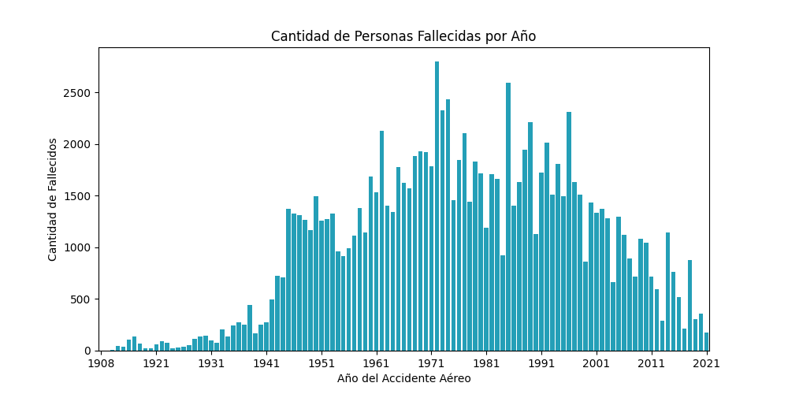
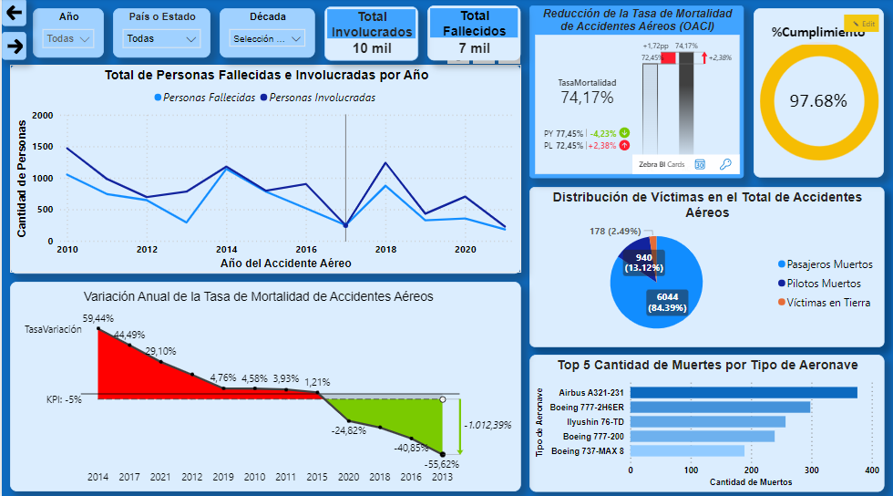
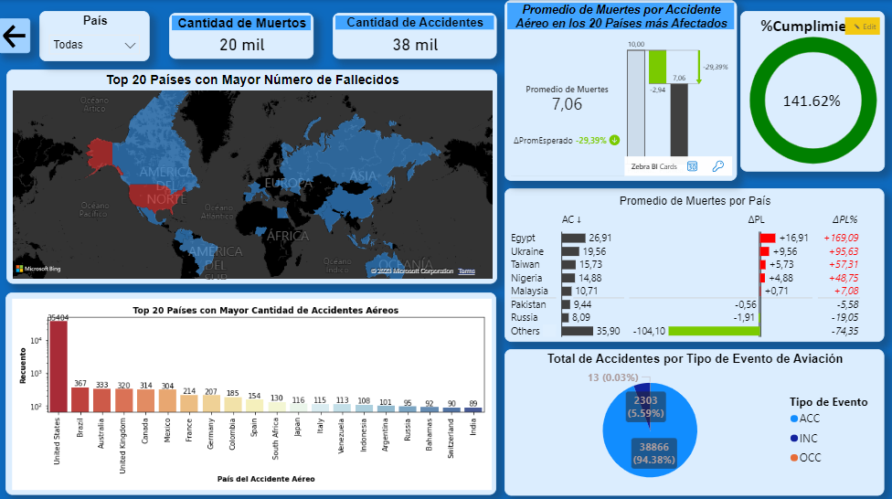

# <h1 align=center> **PROYECTO INDIVIDUAL N°2: Data Analytics** </h1>

# <h1 align="center">**`Accidentes aéreos`**</h1>

  
  

*Bienvenid@s a la presentación del segundo proyecto individual de la carrera de Data Science, el cual fue realizado durante la etapa de Labs del bootcamp [Henry](https://www.soyhenry.com/carrera-data-science)*

# **Contexto**

Los accidentes aéreos son eventos trágicos que involucran la pérdida de vidas humanas y daños materiales significativos en el contexto de la aviación. Estos incidentes capturan la atención y preocupación de la sociedad debido a su impacto devastador. Los accidentes aéreos pueden ser causados por una combinación de factores, como errores humanos, fallos mecánicos, condiciones meteorológicas adversas o incluso actos de sabotaje. La investigación y análisis exhaustivos de estos sucesos son cruciales para comprender sus causas subyacentes y desarrollar medidas de seguridad aérea más efectivas. Al aprender de los accidentes aéreos pasados, se busca mejorar continuamente los estándares de seguridad y minimizar los riesgos en la industria de la aviación, con el objetivo de garantizar vuelos más seguros y confiables para todos los pasajeros, tripulantes y víctimas en tierra.

# **Objetivo**

El proyecto tiene como objetivo recopilar, analizar y visualizar datos relevantes sobre accidentes aéreos con el fin de identificar patrones y tendencias en la seguridad de la aviación civil. Mediante el uso de técnicas de data analytics, se procesarán y analizarán datos de accidentes aéreos, incluyendo fuentes proporcionadas por la Organización de Aviación Civil Internacional (OACI) y otras fuentes como bases de datos gubernamentales, informes de la industria y medios de comunicación. El resultado final será un dashboard interactivo que permita a los usuarios explorar los datos y obtener información sobre accidentes específicos, presentando los hallazgos obtenidos de la información analizada.

# **Análisis Exploratorio de los Datos (EDA)**

  
  

**Consigna:**

El reporte debe incluir un resumen de estadísticas descriptivas de los datasets, análisis univariados (por ejemplo, distribución de variables numéricas), análisis bivariados (correlación entre variables numéricas y/o categóricas) y **cualquier análisis que le ayude al mejor entendimiento de los datos** (encontrar patrones, outliers y/o anomalías, entre otros). El reporte debe presentarse en un notebook (_.ipynb_) con adecuado uso de markdowns y comentarios.

**Resolución de la consigna:**

De acuerdo con las [especificaciones del proyecto](https://github.com/JersonGB22/ProyectoIndividual2_DataAnalytics_Henry/blob/main/Consignas/README.md), se realizó el Análisis Exploratorio de Datos (EDA) en el archivo [EDA.ipynb](https://github.com/JersonGB22/ProyectoIndividual2_DataAnalytics_Henry/blob/main/EDA.ipynb). Se utilizaron el dataset principal de la [La Organización de Aviación Civil Internacional (OACI)](https://raw.githubusercontent.com/JersonGB22/ProyectoIndividual2_DataAnalytics_Henry/main/Datasets/AccidentesAviones.csv) y un dataset complementario de la [National Transportation Safety Board (NTSB)](https://raw.githubusercontent.com/JersonGB22/ProyectoIndividual2_DataAnalytics_Henry/main/Datasets/NTSB_aviation_2000-2022.csv). Antes de llevar a cabo el EDA de cada dataset, se realizó una Extracción, Trasformación y Carga de Datos (ETL) utilizando las librerías de Python: Numpy, Pandas, Regex y Stopwords. Durante este proceso, se eliminaron columnas innecesarias, se convirtieron campos de tipo fecha a tipo datetime y se procesaron algunas columnas categóricas relevantes tanto para el EDA como para la creación de los Dashboards. Además, se imputaron adecuadamente los valores faltantes y se aplicaron transformaciones adicionales para generar un Word Cloud a partir del campo ``summary`` del dataset ``AccidentesAviones.csv``. Por último, se exportaron ambos datasets tratados, listos para ser utilizados en la creación de los dashboards, los cuales se encuentran alojados en la carpeta [Datasets](https://github.com/JersonGB22/ProyectoIndividual2_DataAnalytics_Henry/tree/main/Datasets).

El EDA consistió en análisis univariados, incluyendo la visualización de las principales estadísticas descriptivas de las variables numéricas, boxplots, histogramas y barplots. Además, se realizó un Word Cloud adicional utilizando la variable ``summary``. El análisis bivariado del EDA incluyó la generación de heatmaps y barplots entre las variables más importantes y relevantes.

Por último, se recomienda encarecidamente al lector revisar el notebook donde se encuentra alojado el EDA, ya que contiene explicaciones exhaustivas y comentarios detallados que describen cada paso del proceso realizado.

# **Realización del Dashboard**

  
  

**Consigna:**

Debe ser funcional y coherente con el análisis y la historia que vayan a relatar. **El archivo debe estar en su repositorio** (.pbix, .py o el que aplique).

**Resolución de la consigna:**

El Dashboard se creó utilizando Power BI, una herramienta de análisis y visualización de datos de Microsoft. Se desarrollaron Medidas, Columnas y Tablas específicas para cada KPI, en función de su complejidad. Para cada KPI se generó un informe completo que presenta los gráficos más relevantes, variables destacadas, tarjetas informativas, seguimiento de la evolución del KPI y monitoreo de su cumplimiento. Además, se aprovechó la funcionalidad de los gráficos de Zebra BI y scripts de Python para mejorar la presentación de los informes. El archivo que contiene el Dashboard y su resolución se encuentra denominado como ``Dashboard.pbix``.

# **Planteamiento de KPIs**

**Consigna:**

Se deben sugerir 3 KPIs y deben aparecer en el dashboard. Tenga en cuenta que deben tener relación con la historia que está contando. Asimismo, se espera que en la presentación explique el análisis y la funcionalidad de los KPIs sugeridos.

+ KPI propuesto: Reducir en 5% la tasa de mortalidad a nivel anual, siendo el número de fallecidos en los accidentes aéreos respecto al total de personas en los vuelos involucrados.

**Resolución de la consigna:**

+ KPI 2: Lograr una reducción del 0.8% en el índice de accidentes aéreos por compañía o entidad aérea, enfocándose en las 20 compañías o entidades con el mayor número de accidentes aéreos.

+ KPI 3:  Disminuir la tasa anual de lesiones graves en accidentes aéreos en un 3% con respecto al número total de lesiones ocurridas en accidentes aéreos durante el siglo XXI.

+ KPI 4: Mantener el promedio de muertes por accidente aéreo en los 20 países más afectados por debajo de 10 víctimas fatales.

# **Tecnologías utilizadas:**
| Technology | Documentation |
|------------|---------------|
| Visual Studio Code (VSC) | https://code.visualstudio.com/docs |
| Python | https://docs.python.org/3/ |
| Power BI | https://learn.microsoft.com/en-us/power-bi/ |
| Zebra BI | https://help.zebrabi.com/kb/power-bi/intro-zbi-power-bi/ |
| Git | https://git-scm.com/doc |
| GitHub | https://docs.github.com/en |
| Pandas | https://pandas.pydata.org/docs/ |
| NumPy | https://numpy.org/doc/ |
| Matplotlib | https://matplotlib.org/stable/contents.html |
| Seaborn | https://seaborn.pydata.org/ |
| Stop words | https://pypi.org/project/stop-words/ |
| Stylecloud | https://pypi.org/project/stylecloud/ |
| Regex (expresiones regulares) | https://docs.python.org/3/library/re.html |

  
  
  
  
  
  
  
  
  
  
  

# **Datos del Autor:**
## ***Jerson Brayan Gimenes Beltrán***

### **Correo electrónico:** jerson.gimenesbeltran@gmail.com